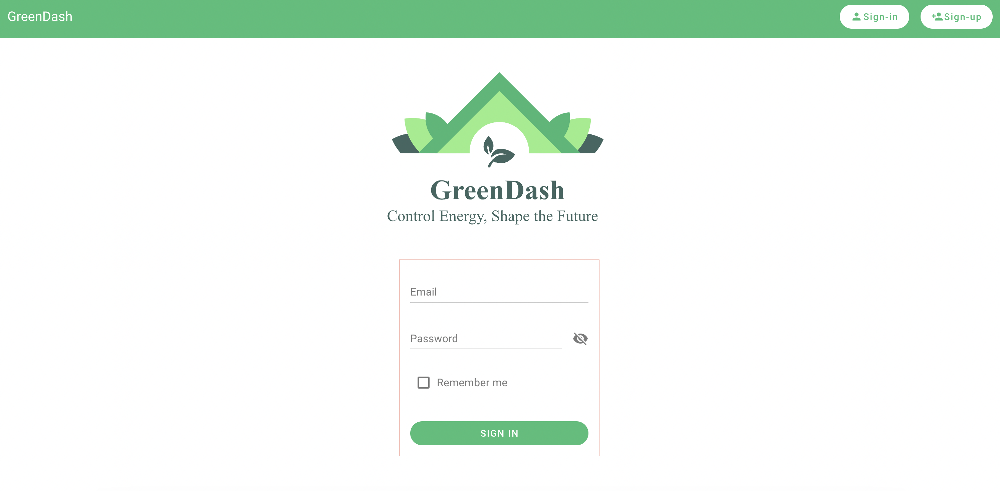
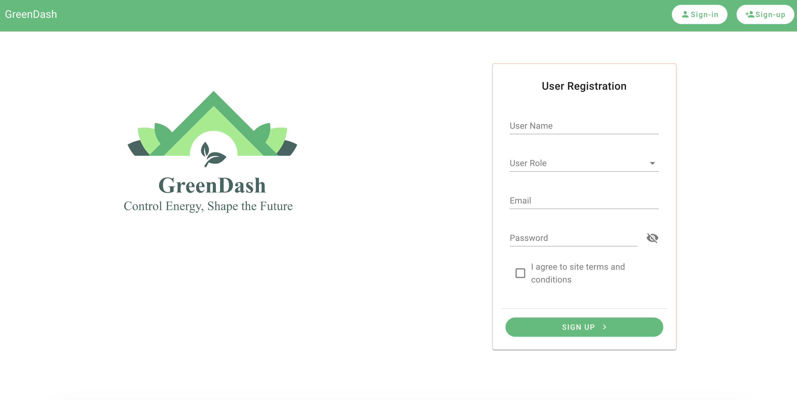
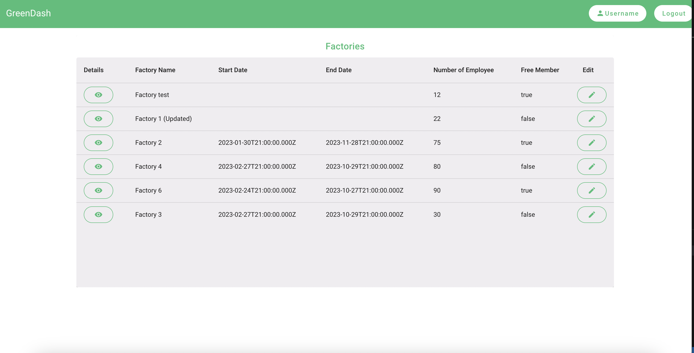
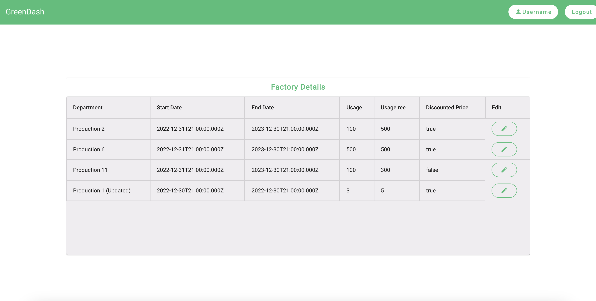
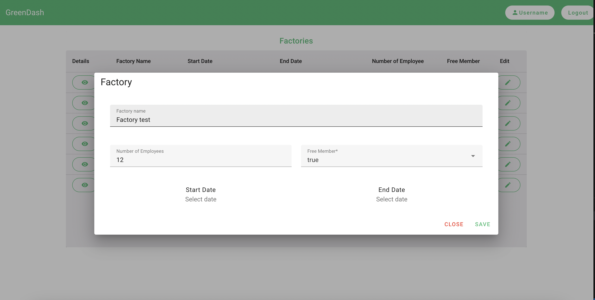

# Patika-final-project
# GreenDash

This web application is built with Nest.js on the backend and Vue.js on the frontend, providing a platform for users to log in, sign up, view lists of factories, and edit factor/factory details.

## Table of Contents

- [Setup](#setup)
  - [Backend](#backend-setup)
  - [Frontend](#frontend-setup)
- [Running the Application](#running-the-application)
- [Technologies Used](#technologies-used)
- [License](#license)

## Setup

### Backend Setup
1. **Clone the repository:**
  ```bash
  git clone https://github.com/cansu3/Patika-final-project.git
  cd Patika-final-project
  ```
2. **Navigate to the backend folder:**
  ```bash
    cd backend
  ```

3. **Install dependencies:**
  ```bash
    npm install
  ```
### Frontend Setup
1. **Navigate to the frontend folder:**
  ```bash
    cd frontend
  ```

2. **Install dependencies:**
  ```bash
    npm install
  ```

## Running the application

### Backend
```bash
    cd backend
    npm start dev
  ```
### Frontend
```bash
    cd frontend
    npm run dev
  ```

## Technologies Used
### Backend
  - NestJS
  - Express

### Frontend
  - vue
  - vuetify
  - pinia

### Database
  - Elasticsearch
  - PostgreSQL

# Screenshots

### Login Page

- The sign-in page allows users to sign in with their credentials.

  

### Signup Page

- The signup page enables new users to create an account.

### Home Page

- Home page displays a list of available factories.

### Factory Details Page

- The factory details page provides detailed information about a specific factory.

### Edit Factory Page

- The edit factory page allows users to modify factory details.
## License
This project is licensed under the MIT License.


